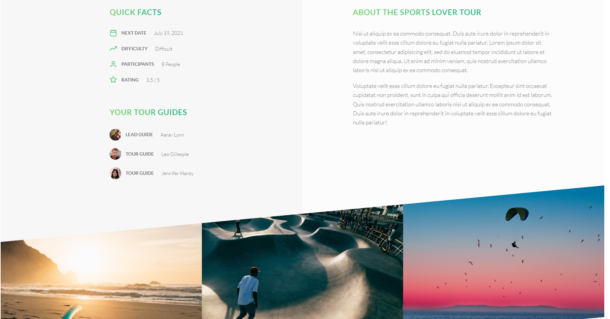

# Natours

- A comprehensive tour booking application built with Node.js, Express, and MongoDB. This project includes features such as token-based authentication, email verification, password reset, tour booking, Stripe payments, and more.
- [Demo and explain](https://youtu.be/ljyVbjtQVG8)

## Features

- Sign up, sign in, sign in with Google
- Email verification
- Password reset
- Blacklisting refresh tokens
- Profile and password update
- Tour booking with available slots
- Stripe payments and webhook for order creation
- Tour reviews (only for booked tours)
- View and edit reviews

## Technologies

- Node.js, Express, MongoDB (Mongoose), MVC, Pug view engine
- Securities
  - NoSQL Injection prevention
  - Data sanitization
  - XSS protection
  - CSRF protection
  - Rate limiting to prevent brute force attacks
- JWT for authentication
- Redis for blacklisting tokens
- Email with Oauth 2.0 and Nodemailer
- Sign in with Google by Oauth 2.0
- Multer and sharp for image uploading
- ...

## Screenshots
### Authentication Pages


### Profile Page


### Home Page


### Tour Detail Page


### Review Page


### Checkout Page


## Project Setup

1. Clone the repository:
   ```sh
   git clone https://github.com/username/natours.git
   
2. Install dependencies:
   ```sh
   npm install

3. Set up environment variables:
   Create a `.env` file in the root directory and add the necessary environment variables. An example `.env` file:
   ```env
    PORT = 5000
    NODE_ENV = development
    
    MONGO_URI = ...
    
    # ACCESS TOKEN
    JWT_SECRET_KEY = ...
    JWT_EXPIRES_IN = 10s
    
    # REFRESH TOKEN
    JWT_SECRET_KEY_FOR_REFRESH = ...
    JWT_EXPIRES_IN_FOR_REFRESH = 1d
    REDIS_REFRESH_TOKEN_EXPIRE = 604800
    
    # RESET PASSWORD
    RESET_PASSWORD_TOKEN_EXPIRE_AT = 900000
    
    EMAIL_ADDRESS = ... (chỗ này điền email nguồn dùng để gửi các email xác nhận)
    
    # OAuth
    CLIENT_ID=...
    CLIENT_SECRET=...
    REDIRECT_URI=https://developers.google.com/oauthplayground
    REFRESH_TOKEN=...
    
    # GOOGLE SIGN IN
    AUTH_CLIENT_ID=...
    AUTH_CLIENT_SECRET=...
    AUTH_REDIRECT_URI=http://localhost:5000/api/auth/google/callback
    
    # STRIPE
    STRIPE_PUBLISHABLE_KEY = ...
    STRIPE_SECRET_KEY = ...
    STRIPE_WEBHOOK_SECRET = ...
    
  4. Start development server:
  ```sh
  npm run start:dev

## Project Structure
```
natours/
├── config/
├── controllers/
├── dev-data/
├── middlewares/
├── models/
├── node_modules/
├── public/
├── routes/
├── utils/
├── views/
├── .env
├── .eslintrc.json
├── .gitignore
├── .prettierrc
├── app.js
├── index.html
├── package-lock.json
├── package.json
├── seeder.js
└── server.js
```

## Error Handling

The application has different error handling mechanisms for development and production environments to ensure proper logging and user-friendly error messages.

- **Development:** Detailed error messages and stack traces are shown for easier debugging.
- **Production:** Generic error messages are shown to the user, while detailed error logs are stored for debugging purposes.

## API Endpoints

### Auth
- Register: `POST /api/v1/users/signup`
- Login: `POST /api/v1/users/login`
- Logout: `GET /api/v1/users/logout`
- Forgot Password: `POST /api/v1/users/forgotPassword`
- Reset Password: `PATCH /api/v1/users/resetPassword/:token`
- Update Profile: `PATCH /api/v1/users/updateMe`
- Update Password: `PATCH /api/v1/users/updateMyPassword`

### Tours
- Get All Tours: `GET /api/v1/tours`
- Get Tour: `GET /api/v1/tours/:id`
- Create Tour: `POST /api/v1/tours` (Admin)
- Update Tour: `PATCH /api/v1/tours/:id` (Admin)
- Delete Tour: `DELETE /api/v1/tours/:id` (Admin)

### Bookings
- Create Booking: `POST /api/v1/bookings`
- Get All Bookings: `GET /api/v1/bookings`
- Get Booking: `GET /api/v1/bookings/:id`
- Update Booking: `PATCH /api/v1/bookings/:id`
- Delete Booking: `DELETE /api/v1/bookings/:id`

### Reviews
- Get All Reviews: `GET /api/v1/reviews`
- Get Review: `GET /api/v1/reviews/:id`
- Create Review: `POST /api/v1/reviews`
- Update Review: `PATCH /api/v1/reviews/:id`
- Delete Review: `DELETE /api/v1/reviews/:id`


## Contribution
Feel free to fork this project and submit pull requests. Any contributions are greatly appreciated.

## License
This project is licensed under the MIT License.
